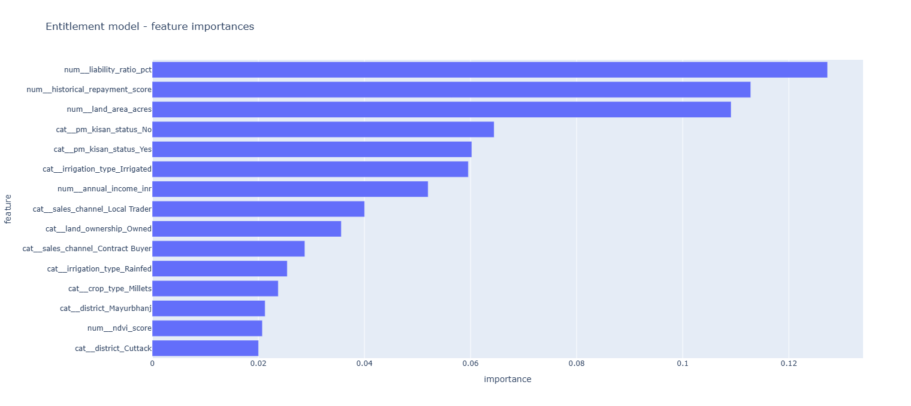
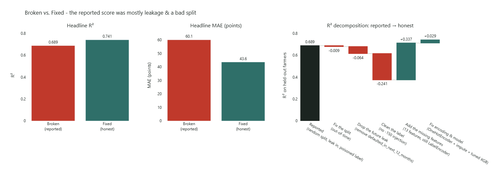

# Yogyank Scoring Engine

A **bank-agnostic farmer entitlement-scoring model:** a
continuous, explainable score that estimates a farmer's entitlement from
application-time information, with policy applied transparently *afterwards*
rather than baked into the model.

This project pairs a deliberately flawed baseline trainer with a data-audit tool that
exposes the traps (data leakage, a misleading validation split, and policy
injected into the label), then delivers a corrected pipeline that earns an
honest score. The full write-up lives in [`AUDIT_MEMO.md`](AUDIT_MEMO.md).

---

## Submission notes

**Time spent**
- Start: 11:30 IST, 15 Jun 2026
- End: 01:30 IST, 16 Jun 2026 (worked in sittings across that window)
- Approximate active time: ~2 hours

**Setup and how to run**

```powershell
pip install -r requirements.txt        # Python 3; a virtual environment is recommended
python broken_yogyank_training.py      # 1. the flawed baseline and its inflated score
python build_yogyank_data_explorer.py  # 2. the data-audit HTML report
python fixed_yogyank_training.py        # 3. the corrected pipeline (the deliverable)
python compare_models.py               # 4. broken vs. fixed, side by side
```

Full details are in **Project setup** and **Recommended workflow** below.

**Files generated** (all under `artifacts/`, created automatically)
- `entitlement_model.pkl` : the deployable pipeline bundle (from the fixed trainer)
- `model_metadata.json` : schema/contract, feature list, library versions, data hash, validation summary
- `feature_importances.html` and `feature_importances_plot.png`
- `compare_models.html` and `compare_models_plot.png`
- `yogyank_data_explorer.html` : the offline data-audit report
- `xgboost_baseline.pkl` : the flawed baseline (from the broken script)

**Completed**
- Upstream-first audit of the broken pipeline (`AUDIT_MEMO.md`)
- Corrected, leakage-free training pipeline with an out-of-time split
- Honest evaluation: a mean baseline plus MAE and R²
- Broken-vs-fixed decomposition quantifying each fix's contribution
- Offline data-audit explorer (schema, leakage, temporal, policy panels)
- Reproducible artifacts: full pipeline bundle plus metadata (versions, data hash, shared schema)
- Global feature-importance explainability

**Skipped (time-boxed; these are the next steps)**
- Per-applicant reason codes (SHAP); only global feature importances exist
- Fairness / bias review across district, land ownership, and income bands
- Rolling / expanding-window time-series cross-validation (a single 2024 fold was used)
- An explicit, tested post-prediction policy layer for PM-Kisan
- Hyperparameter tuning (kept to modest, sane defaults)
- Auto-exported plot images (the PNGs are currently hand-captured) and a LICENSE

**Assumptions (especially feature availability and timing)**
- The as-of-date contract lives in `schema.py` and is exported to `model_metadata.json`.
  Columns marked **available** (district, land area, irrigation type, land ownership, soil
  type, PM-Kisan status) are taken as known at application time.
- Columns marked **verify_as_of** (`historical_repayment_score`, `annual_income_inr`,
  `liability_ratio_pct`, `rainfall_deviation_pct`, `ndvi_score`, `crop_type`,
  `sales_channel`) are *assumed* to be as-of the scoring date but not verified; some could be
  season aggregates or later reconciliations that quietly bleed past the scoring date
  (subtler leakage than the obvious default flag).
- `defaulted_in_next_12_months` is treated as a future outcome and excluded entirely.
- `target_entitlement_score` is taken as the ground-truth label (after removing the
  150-point PM-Kisan rule the draft baked in); the dataset is synthetic.
- PM-Kisan is treated as a learned feature; any business-policy adjustment is assumed to
  live in a separate, transparent post-model layer.

**Validation approach, and whether I trust the result**
- Out-of-time split: train on application years ≤ 2023, test on 2024, to mimic scoring a
  future cohort. Reported against a mean baseline in both MAE and R². The broken-vs-fixed
  decomposition isolates each fix's effect on the same holdout.
- Result: fixed model R² 0.7413 / MAE 43.59 vs. a baseline of MAE 87.35.
- I trust the **methodology and the structural correctness** (checked against the code; see
  `LLM_NOTES.md` Part 3). I do **not** treat the numbers as production-ready: the data is
  synthetic, several features' as-of-date status is assumed rather than verified, and only a
  single time fold was used. Read the score as a sound baseline, not a validated production
  metric.

---

## Recommended workflow

Run the pieces in this order to follow the story from problem to fix:

```powershell
python broken_yogyank_training.py       # 1. the flawed draft and its inflated score
python build_yogyank_data_explorer.py   # 2. audit the data; see WHY the score is fake
python fixed_yogyank_training.py        # 3. the corrected pipeline and its honest score
python compare_models.py                # 4. broken vs. fixed, side by side
```

Then read [`AUDIT_MEMO.md`](AUDIT_MEMO.md) for the full analysis and the
limitations that remain.

---

## What's in here

```
yogyank-scoring-engine/
├── farmer_scoring_sample_yogyank.csv          # synthetic dataset
├── broken_yogyank_training.py                 # 1. flawed baseline trainer
├── build_yogyank_data_explorer.py             # 2. data-audit HTML explorer
├── fixed_yogyank_training.py                  # 3. corrected pipeline (the deliverable)
├── compare_models.py                          # 4. broken vs. fixed comparison
├── schema.py                                  # shared schema + as-of-date contract
├── AUDIT_MEMO.md                              # full written audit
├── LLM_NOTES.md                               # prompts & replies + key lessons
├── yogyank_data_explorer_example.html         # prebuilt fallback report
├── requirements.txt
└── artifacts/                                 # generated outputs (git-tracked, regenerable)
    ├── xgboost_baseline.pkl                    # from broken_yogyank_training.py (the flawed baseline)
    ├── entitlement_model.pkl                   # from fixed_yogyank_training.py (the deliverable)
    ├── model_metadata.json                     # schema, versions, validation summary, data hash
    ├── feature_importances.html               # from fixed_yogyank_training.py
    ├── feature_importances_plot.png           # static snapshot of the above (for docs)
    ├── compare_models.html                    # from compare_models.py
    ├── compare_models_plot.png                # static snapshot of the above (for docs)
    └── yogyank_data_explorer.html             # from build_yogyank_data_explorer.py
```

Everything under `artifacts/` is produced by running the scripts. It is safe to
delete the whole folder; re-running the scripts recreates it from scratch.

| File | Role |
|------|------|
| `farmer_scoring_sample_yogyank.csv` | Synthetic farmer dataset (~features + target + a forward-looking outcome). |
| `broken_yogyank_training.py` | A **deliberately flawed** baseline XGBoost trainer (the "looks great, ship it" draft). Demonstrates the mistakes. |
| `fixed_yogyank_training.py` | The **corrected** pipeline: leakage removed, out-of-time split, proper encoding, persisted end-to-end. The actual deliverable. |
| `compare_models.py` | Puts broken vs. fixed **side by side** and decomposes where the inflated score came from. |
| `schema.py` | Single source of truth for the feature lists and the **as-of-date contract**, shared by the trainer and the explorer. |
| `build_yogyank_data_explorer.py` | Builds the **HTML Data Explorer**, a self-contained, offline data audit. |
| `AUDIT_MEMO.md` | The full written **audit**: what was dangerous, what changed, and what limitations remain. |
| `LLM_NOTES.md` | The **prompts & replies** that built the project, plus the key lessons in Q&A form (as-of-date contract, model vs. policy, measuring leakage). |
| `artifacts/` | Generated outputs (model `.pkl` and HTML reports). Created automatically when you run the scripts; safe to delete and regenerate. |
| `yogyank_data_explorer_example.html` | A prebuilt example report, as a fallback for when you can't generate your own. |
| `requirements.txt` | Python dependencies. |

The dataset's target is `target_entitlement_score`. The column
`defaulted_in_next_12_months` is a **forward-looking outcome** that cannot be
known at scoring time. Using it as a feature is leakage, and the explorer marks
it in red everywhere it appears.

---

## Project setup

You need Python 3. From the project folder, install the dependencies:

```powershell
pip install -r requirements.txt
```

> Using a virtual environment is recommended so the pinned versions don't clash
> with other projects:
>
> ```powershell
> python -m venv .venv
> .\.venv\Scripts\Activate.ps1
> pip install -r requirements.txt
> ```

---

## The baseline trainer (`broken_yogyank_training.py`)

This is the *starting point*, not the goal. Running it trains an XGBoost
regressor and reports a suspiciously high R²:

```powershell
python broken_yogyank_training.py
```

It writes a model to `artifacts/xgboost_baseline.pkl` and prints a glowing
validation score, which is exactly the problem. The script:

- uses `defaulted_in_next_12_months` (a future outcome) as a feature → **leakage**,
- splits the data **randomly** instead of out-of-time, and
- subtracts 150 from the label for non-PM-Kisan farmers → **policy baked into the target**.

The Data Explorer below quantifies how much of that "great" score is illusion.

---

## The HTML Data Explorer (`build_yogyank_data_explorer.py`)

A single, self-contained, **offline-viewable** HTML report that audits the data
before you trust it: schema/leakage contract, target shape, signal-vs-leakage,
missingness, temporal drift, and the policy-injection illustration. The full
Plotly library is embedded in the file, so no server or internet is needed to view it.

**The preferred way is to generate it yourself.** Run `build_yogyank_data_explorer.py` to
build the report from the CSV, then open the result. A prebuilt
`yogyank_data_explorer_example.html` is included only as a **fallback** for when
you can't generate your own.

### Generate it (preferred)

```powershell
python build_yogyank_data_explorer.py
```

This reads the default CSV and writes `artifacts/yogyank_data_explorer.html`
(the `artifacts/` folder is created automatically). You can also pass a custom
input CSV and/or output filename:

```powershell
python build_yogyank_data_explorer.py path/to/data.csv out.html
```

> The "R² collapse" waterfall panel needs `xgboost` + `scikit-learn` (already in
> `requirements.txt`). If they were missing, that one panel degrades to a short
> note instead of crashing.

### Open it

The report is a single `.html` file you can open in any browser. Open the report
you just generated:

```powershell
# Your own generated report, from the project folder
start artifacts\yogyank_data_explorer.html

# Or with a full path
start D:\trynew\yogyank-scoring-engine\artifacts\yogyank_data_explorer.html
```

Fallback: if you couldn't generate your own, open the prebuilt example instead:

```powershell
start yogyank_data_explorer_example.html
```

Open in a specific browser instead of the default:

```powershell
Start-Process chrome  .\artifacts\yogyank_data_explorer.html   # Chrome
Start-Process msedge  .\artifacts\yogyank_data_explorer.html   # Edge
Start-Process firefox .\artifacts\yogyank_data_explorer.html   # Firefox
```

You can also just **double-click** the file in File Explorer.

### Generate and open in one line

```powershell
python build_yogyank_data_explorer.py && start artifacts\yogyank_data_explorer.html
```

### What the report covers

| # | Section | Question it answers |
|---|---------|---------------------|
| 01 | Schema & as-of-date contract | What's in the table, and which fields are we allowed to use? |
| 02 | Target | What are we predicting? |
| 03 | Signal vs. leakage | Is there real signal, and where is the trap? |
| 04 | Gaps | Where is the data thin or absent? |
| 05 | Temporal | Can we validate the future (out-of-time split)? |
| 06 | Policy | Model vs. injected policy rule |
| 07 | Explore | Interactive per-column histograms / counts |

---

## The fixed pipeline (`fixed_yogyank_training.py`)

This is the **deliverable**: a corrected trainer that earns an honest score.
It removes the future-leak feature, stops poisoning the label, uses a
**time-based (out-of-time) split**, encodes categoricals properly inside a
single `sklearn` `Pipeline`, and persists the whole pipeline plus metadata so it
can be reloaded and used.

```powershell
python fixed_yogyank_training.py
```

It writes the model bundle to `artifacts/entitlement_model.pkl` and a feature-
importance chart to `artifacts/feature_importances.html`, and prints honest,
out-of-time results:

| Model | R² | MAE (points) |
|-------|-----|------|
| Baseline (predict the mean) | 0.0000 | 87.35 |
| Broken (self-reported, leaked) | 0.6886 | 60.07 |
| **Fixed (honest, out-of-time)** | **0.7413** | **43.59** |

The fixed model roughly **halves the baseline error** on a held-out future year.
The broken model's higher-looking number was inflated by a poisoned label and a
future-leak feature; see [`AUDIT_MEMO.md`](AUDIT_MEMO.md) for the full breakdown.

The top drivers are all legitimate, scoring-time signals (liability ratio,
repayment history, land area, PM-Kisan), with no leak or injected-policy artifact
among them:



*Snapshot of `artifacts/feature_importances.html`; open that file for the
interactive version.*

### Using the trained model

The saved bundle carries everything needed to score a raw farmer record, with no
manual preprocessing:

```python
import joblib
import pandas as pd

bundle = joblib.load("artifacts/entitlement_model.pkl")
pipeline, features = bundle["pipeline"], bundle["features"]

# A raw record with the same columns as the training data (no encoding needed):
record = pd.DataFrame([{
    "land_area_acres": 8.5, "historical_repayment_score": 70.0,
    "annual_income_inr": 350000, "liability_ratio_pct": 15.0,
    "rainfall_deviation_pct": -5.0, "ndvi_score": 0.55,
    "district": "Cuttack", "crop_type": "Rice", "pm_kisan_status": "Yes",
    "irrigation_type": "Irrigated", "land_ownership": "Owned",
    "soil_type": "Black", "sales_channel": "APMC",
}])

score = pipeline.predict(record[features])[0]
print(f"Estimated entitlement score: {score:.1f}")
```

---

## Comparing broken vs. fixed (`compare_models.py`)

Reproduces the broken model exactly as written, then peels its crutches one at a
time (fix the split, drop the leak, clean the label, add real features) so you
can see precisely where the inflated score came from.

```powershell
python compare_models.py
```

Prints a side-by-side table and writes a visual to
`artifacts/compare_models.html` (headline R²/MAE bars plus an R² decomposition
waterfall).



*Snapshot of `artifacts/compare_models.html`. The waterfall shows the reported
0.689 collapsing as each crutch is removed (the poisoned label costs the most,
-0.241), then recovering to an honest 0.741 once real features and proper
encoding are added.*

---

## Limitations

This is a sound **baseline**, not a production-validated system. The data is
synthetic, the as-of-scoring-date status of several features is still unverified
(subtler leakage risk), it uses a single out-of-time fold, and there is no
fairness review yet. See §3 of [`AUDIT_MEMO.md`](AUDIT_MEMO.md) for the full
list and what to improve next.

---

## Notes

The data is **synthetic** and the R² figures in the report are a *directional*
reproduction of the draft trainer, not exact. Nothing here is a production
validation result; the point is the methodology, not the numbers.
